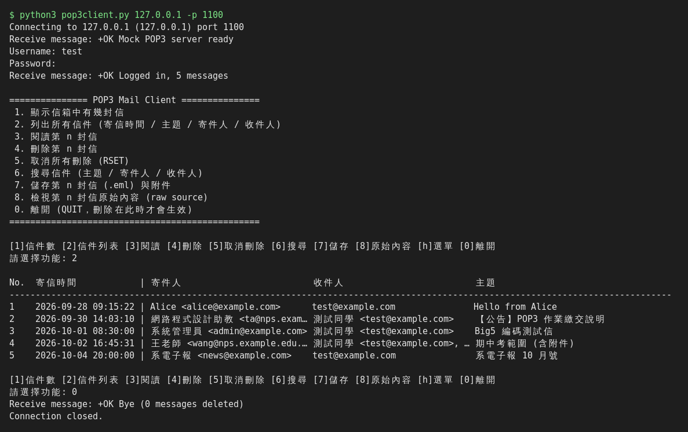
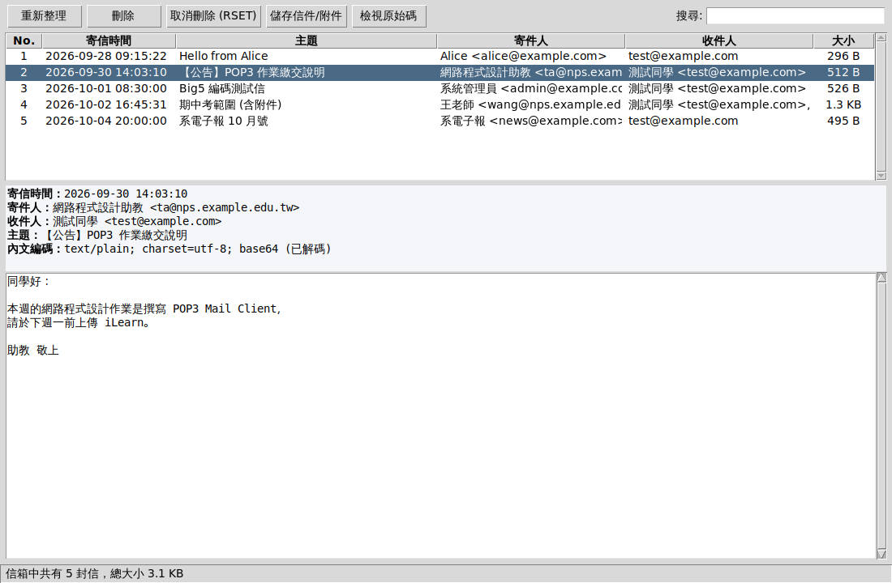

# 任務一：POP3 Mail Client

修改自範例 `pop3client.py`。程式用 TCP socket 直接送出 POP3 指令，再用 Python 內建的 `email` 模組解析和解碼信件。只需要 Python 3 標準函式庫，不必另外安裝套件。

> 學號：D1211110　姓名：陳嘉希

## 檔案

| 檔案 | 說明 |
|---|---|
| `pop3client.py` | 作業本體，含文字選單模式和 GUI 模式 |
| `mock_pop3_server.py` | 測試用 POP3 伺服器，內含 5 封不同編碼的測試信 |
| `screenshots/` | 每個功能的執行結果截圖 |

## 執行方式

```bash
# 連線到課堂的 POP3 伺服器 (port 110)
python3 pop3client.py ServerIP

# 其他選項
python3 pop3client.py ServerIP -p 1100     # 指定 port
python3 pop3client.py pop.gmail.com --ssl  # POP3 over SSL (port 995)
python3 pop3client.py ServerIP -v          # 顯示 C:/S: 協定對話過程
python3 pop3client.py --gui                # 圖形介面 (tkinter)
python3 pop3client.py                      # 不加參數 (或直接雙擊檔案) 也會開啟圖形介面
```

沒有可用的郵件伺服器時，可以先在本機啟動測試伺服器（帳號 `test`，密碼 `1234`；SMTP 寄信用 port `2525`）：

```bash
python3 mock_pop3_server.py 1100          # 視窗 1
python3 pop3client.py 127.0.0.1 -p 1100   # 視窗 2
```

## 功能與 POP3 指令對照

| 功能 | 使用的 POP3 指令 | 截圖 |
|---|---|---|
| (1) 秀出 mailbox 中有幾封 mail | `STAT` | `cli_1_count.png` |
| (2) 列出每封信的寄信時間、主題、寄件人、收件人 | `LIST` + `TOP n 0`（只抓標頭） | `cli_2_list.png` |
| (3) 列出第 nn 封信的內容並解碼 | `RETR n` + MIME 解碼 | `cli_3a/3b/3c_*.png` |
| (4) 刪除第 nn 封信 | `DELE n`，在 `QUIT` 時生效 | `cli_4_delete.png`、`cli_4b_after_quit.png` |
| 加分：取消刪除 | `RSET` | `cli_5_extra.png` |
| 加分：關鍵字搜尋、儲存 .eml 和附件、檢視原始信件 | `RETR` | `cli_5_extra.png` |
| 加分：顯示協定對話 (`-v`) | 全部 | `cli_6_verbose.png` |
| 加分：POP3S (`--ssl`) | 以 TLS 包裝 socket | — |
| 加分：GUI (`--gui`) | 全部 | `gui_*.png` |
| 加分：寄信（中文主題和內文用 UTF-8 Base64 編碼） | SMTP `EHLO`/`MAIL FROM`/`RCPT TO`/`DATA` | `gui_7_compose.png`、`gui_8_after_send.png` |

### 解碼處理
- **標頭**：用 `decode_header` 解 RFC 2047 編碼字（例如 `=?UTF-8?B?...?=`、`=?big5?B?...?=`）。
- **內文**：`get_payload(decode=True)` 會處理 Base64 和 Quoted-Printable，再依 `charset` 轉成文字（Big5 用 cp950 解碼，相容性較好）。
- **multipart**：優先顯示 `text/plain`。如果只有 HTML，就去掉標籤後轉成純文字顯示。附件會另外列出，也可以存檔。
- **多行回應**：讀到單獨一行 `.` 才結束，並依 RFC 1939 還原 dot-stuffing（行首的 `..` 改回 `.`）。

### 關於刪除
依 POP3 協定，`DELE` 只會把信標記為刪除。送出 `QUIT` 時伺服器才會真正刪除；在那之前可以用 `RSET` 全部復原。信件被標記刪除後，其他信的編號在這次連線中不會改變。

## 截圖

截圖是用 `mock_pop3_server.py` 的測試信件跑出來的。如果老師要求連線到課堂的伺服器，請用相同步驟重拍。

| CLI | GUI |
|---|---|
|  |  |
